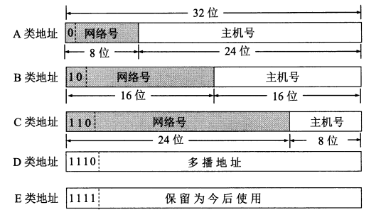

#IP地址

##定义：
IP地址（Internet Protocol Address）是指互联网协议地址，又译为网际协议地址。  
IP地址用来给互联网上每一个主机（或路由器）分配一个全世界范围唯一的地址标识符。

##表示方式：
IPV4共32位，通常被分割成4个8位的二进制，采用**点分十进制**表示，例如：192.168.158.100  
IPv6共128位，通常被分割成8个16位的二进制，通常采用**冒分16进制**表示，例如：ABCD:EF01:2345:6789:ABCD:EF01:2345:6789

##分类的IP地址：
分类的IP地址就是将IP地址划分为若干个固定类，每一类地址都有两个固定长度的字段组成。
- 第一个字段是**网络号（net-id）**，它标志主机（或路由器）所连接到的网络。一个网络号在互联网内必须是唯一的。
- 第二个字段是**主机号（host-id）**,它标志该主机（或路由器），以太主机号在它前面的网络号所致命的网络范围内是唯一的。

由此可见，一个IP地址在整个互联网范围内是唯一的。  
这种两级的IP地址可以记为：`IP={<网络号>,<主机号>}`  
具体的分类如下图所示：

从上图中可以看出：
- A类、B类和C类地址的网络号字段（在图中这个字段是灰色的）分别是1个、2个和3个字节长，
而在网络号字段的最前面有1到3为的**类别位**，其数值分别规定为0，10和110。
- A类、B类和C类地址的主机号字段分别为3个、2个和一个字节长。
- D类地址（前4位是1110）用于**多播**（一对多通信）。
- E类地址（前4位是1111）保留以后使用。

各类地址的范围如下表所示：  

|类别|范围|
|-----|---------------------------|
| A类 |0.0.0.0 到 127.255.255.255  |
| B类 |128.0.0.0 到 191.255.255.255|
| C类 |192.0.0.0 到 223.255.255.255|
| D类 |224.0.0.0 到 239.255.255.255|
| E类 |240.0.0.0 到 247.255.255.255|

##IP地址的特点
1. 每一个IP地址都有网络号和主机号两部分组成。从这个意义上说，IP地址是一种**分等级的地址结构**。分两个等级的好处是：
    - IP地址管理机构在分配IP地址时**只分配网络号（第一级）**，而剩下的主机号（第二级）则有得到该网络号的单位自行分配。
    这样就方便了IP地址的管理。
    - 路由器**仅根据目的主机所连接的网络号来转发分组（而不考虑目的主机号）**，这样可以是路由表中的项目数大幅度减少，
    从而**减少了路由表所占的内存空间和查找路由表的时间**。
2. 实际上IP地址是标志一台主机（或路由器）和一条链路的接口。当一台主机同时连接到两个网络上时，该主机就必须同时具有两个IP地址，
其网络号必须是不同的。这种主机称为**多归属主机（multihomed host）**。由于一个路由器至少应当连接到两个网络，因此一个路由器
至少应当有两个不同的IP地址。
3. 按照互联网的观点，一个网络是指具有相同网络号net-id的主机集合，因此，**用转发器和网桥连接起来的若干个局域网仍为一个网络**，
因为这些局域网都有同样的网络号。具有不同网络号的局域网必须使用路由器进行互连。
4. 在IP地址中，所有分配到网络号的网络（不管是范围很小的局域网，还是可能覆盖很大地理范围的关于网）都是**平等**的。
所谓平等，是指互联网等同对待每一个IP地址。