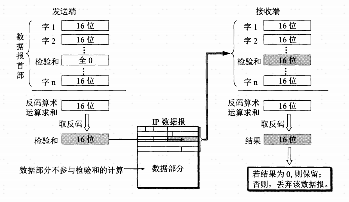

#IP协议

##概述
  IP是TCP/IP协议族中最为核心的协议。所有的TCP、UDP、ICMP及IGMP数据都已IP数据报格式传输。  
    
  不可靠（unreliable）的意思是它不能保证IP数据报能成功地到达目的地。IP仅提供最好的传输服务。
如果发生某种错误时，如某个路由器暂时用完了缓冲区，IP有一个简单的错误处理算法：丢弃该数据报，
然后发送ICMP消息报给信源端。任何要求地可靠性必须有上层来提供（如TCP）。  
  
  无连接（connectionless）这个术语的意思是IP并不维护关于后续数据报的状态信息。每个数据报的
处理都是相互独立的。这也说明，IP数据报可以不按发送顺序接收。如果一信源向相同的信宿发送两个连续地
数据报（先是A，然后是B），每个数据报都是独立地进行路由选择，可能选择不同的路线，因此B可能在A到达
之前先到达。

##首部格式

每个字段意思如下：  
1. **版本**： 占4位，指IP协议的版本。通信双方使用的IP协议版本必须一致。目前广泛使用的IP协议号为4（既IPV4）。

2. **首部长度**： 占4位，可表示最大十进制数值是15。注意，首部长度字段所表示的单位是32位字（既4字节）。
因为IP首部的固定部分长度是20字节，所以首部长度最小值是5（既0101）。而当首部长度为最大值1111时（既十进制数是15），
就表明首部长度达到最大值15个32位字长，既60字节。当IP首部长度不是4字节的整数倍时，必须利用最后的填充字段加以填充。
因此IP数据报的数据部分永远在4字节的整数倍开始，这样在实现IP协议时比较方便。首部长度限制为60字节的缺点是有时可能不够用。
但这样做是希望用户尽量减少开销。最常用的首部长度是20字节，这时不适用任何选项。

3. **分区服务（服务类型TOS）**： 占8位，包括一个3位的优先权子字段（现在已被忽略），4为的TOS子字段和1位未使用位但必须置0。
4位的TOS分别代表：最小延时、最大吞吐量、最高可靠性和最小费用。4位中只能置其中一位。如果所有4位均为0，那么意味着一般服务。

4. **总长度**： 总长度指首部和数据之和的长度，单位为字节。总长度字段为16位，因此数据报的最大长度为2^16 - 1=65535字节。
然而实际上传送这样长的数据报在现实中是极少的。  
   在IP层下面的每一种数据链路层协议都规定了一个数据帧中的**数据字段的最大长度**，这称为**最大传送单元MTU（Maximum Transfer Unit）**。
   当一个IP数据报封装成连路层的帧时，次数据报的总长度（即首部加上数据部分）一定不能超过下面的数据链路层所规定的MTU值。例如，
   最常用的以太网就规定其MTU值为1500字节。若所传送的数据报长度超过数据链路层的MTU值，就必须把过长的数据报进行分片处理。  
   在进行分片时（见后面的“片偏移量”字段），数据报首部的“总长度”字段是指**分片后的每一片**的首部长度与该片的数据长度的总和。
   
5. **标识（identification）**： 占16位，IP软件在存储器中维持一个计数器，每产生一个数据报，计数器就会加1，并将此值赋给
标识字段。但这个“标识”并不是序号，因为IP是无连接服务，数据报不存在按序接收的问题。当数据报长度超过网络的MTU而必须分片时，
这个标识字段的值就被复制到所有的数据报片的标识字段中。相同的表示字段的值使分片后的各数据报片最后能正确的重装起来。
   
6. **标志（flag）**： 占3位，但目前只有两位有意义。
    - 标志字段中的最低位记为**MF(More Fragment)**。 MF=1即表示后面**“还有分片”**的数据报。MF=0表示这已是若干数据报片中的最后一个。
    - 标志字段中间的一位记为**DF（Don’t Fragment）**，意思是**“不能分片”**。只有当DF=0时才允许分片。

7. **片偏移**： 占13位。片偏移指出：较长的数据报在分片后，某片在原分组中的相对位置。

8. **生存时间TTL(Time To Live)**： 占8位，这是数据报在网络中的寿命。发出数据包的源点设置该字段，防止无法交付的数据报
在网络中兜圈子浪费资源。最初的设计是以秒为单位，每经过一个路由器，就把TTL减去数据报在路由器所消耗掉的一段时间，若数据包在
路由器消耗的时间小于1秒则按照1秒来算。现在随着技术的进步，路由器处理数据报的时间都远远小于1秒，就把TTL字段的功能改为**“跳数限制”**，
路由器在每次转发数据报之前就把TTL值减1。
   
9. **协议**： 占8位，协议字段指出此数据报携带的数据是使用的哪种协议，以便目的主机的IP层应将数据部分上交给哪个协议进行处理。
常见的协议字段如下：   
   
    |协议名称|协议字段值|
    |-------|--------|
    |ICMP|1|
    |IP|2|
    |IP|4|
    |TCP|6|
    |EGP|8|
    |IGP|9|
    |UDP|17|
    |IPv6|41|
    |ESP|50|
    |OSPF|89|
   
10. **首部检验和**： 占16位。这个字段**只检验数据报的首部，不包括数据部分**。这是因为数据报每经过一个路由器，
路由器都要重新计算一下首部校验和（依稀额字段，如生存时间、标志、片偏移等都可能发生变化）。不检验数据部分可减少计算的量。
    
11. **源IP地址**： 占32位。
12. **目的IP地址**： 占32位。
13. **可选字段（选项）**： 长度可变，从1个字节到40个字节不等，取决于所选择的项目。可以用来支持排错、测量安全等措施。
某些项目只有一个字节，有些项目有多个字节，这些选项一个一个拼接起来，中间不需要有分隔符，最后用全0填充字段补齐为4字节的整数倍长度。
    
##服务类型TOS使用情况
下表列出了一些不同应用建议的TOS值：  

|应用程序|最小时延|最大吞吐量|最高可靠性|最小费用|
|-----------------|-------|--------|--------|-------|
|**Telnet/Rlogin**|1|0|0|0|
|**FTP**（控制）|1|0|0|0|
|**FTP**（数据）|0|1|0|0|
|**FTP**（任意块数据）|0|1|0|0|
|**TFTP**|1|0|0|0|
|**SMTP**（命令阶段）|1|0|0|0|
|**SMTP**（数据阶段）|0|1|0|0|
|**DNS**（UDP查询）|1|0|0|0|
|**DNS**（TCP查询）|0|0|0|0|
|**DNS**（区域传输）|0|1|0|0|
|**ICMP**（差错）|0|0|0|0|
|**ICMP**（查询）|0|0|0|0|
|**ICMP**（任何IGP）|0|0|1|0|
|**SNMP**|0|0|1|0|
|**BOOTP**|0|0|0|0|
|**NNTP**|0|0|0|1|

##检验和
###计算逻辑
首先把检验和字段设置为0，然后对首部中每个16bit进行二进制反码求和，求和结果的反码存到字段中。
###校验逻辑
同样对首部中每个16bit进行二进制反码求和，再将求和结果取其反码，如果结果全为0，则通过检验。

整个过程如下图所示：

