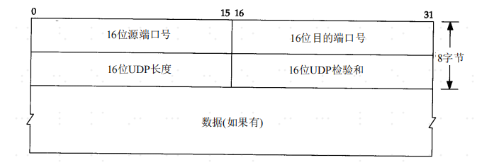
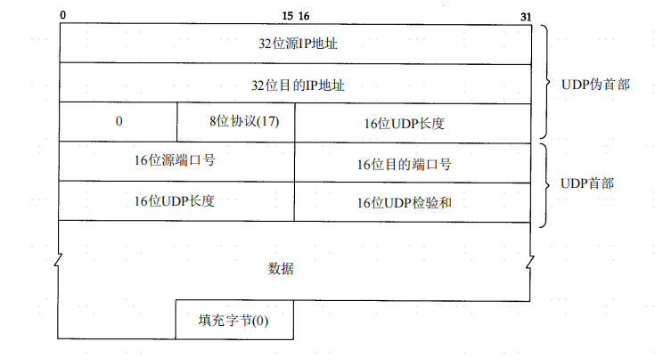
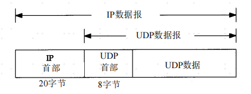

#UDP 用户数据报协议

##一：概述
UDP协议只是在IP协议的数据报服务上增加了很少一点的功能，就是复用和分用的功能以及差错检测的功能。

##二：UDP的特点：
1. **UDP是无连接的**。发送数据之前不需要建立连接（发送数据结束时也没有链接可释放），
   因此减少了开销和发送数据之前的时延。
   
2. **UDP是尽最大努力交付**。既不保证可靠交付，因此主机不需要维持复杂的链接状态表。

3. **UDP是面向报文**的。发送方的UDP对应用程序交下来的报文，在添加首部后就向下交付IP层。
   UDP对应用层交下来的报文，既不合并也不拆分，而是**保留这些报文的边界**。这就是说，应用层
   交给UDP多长的报文，UDP就照样发送，即一次发送一个报文。因此，应用程序必须选择合适大小的报文。
   若报文太长，UDP交给IP层后，IP层在传送时可能要进行分片，这回降低IP层的效率。反之，若报文
   太短，UDP把它交给IP层后，会使IP数据报的首部的相对长度太大，这也降低了IP层的效率。
   
4. **UDP没有拥塞控制**。因此网络出现拥塞不会使源主机的发送高频率降低。这对某些实时应用很重要。
   很多的实时应用（如IP电话、实时视频会议等）要求源主机以恒定的速率发送数据，允许在网络发生拥塞时
   丢失一些数据，但却不允许数据有太大的时延。UDP正好适合这种要求。
   
5. **UDP支持一对一、一对多、多对一和多对多的交互通信**。

6. **UDP的首部开销小**。只有8个字节，比TCP的20个字节首部要短。

##三：首部格式

1. **16位源端口号**：在需要对方回信时选用。不需要是可用全0。
2. **16位目的端口号**： 这在终点交付报文时必须使用。
3. **16位长度**： UDP数据报的总长度，最小值是8（仅有首部）。
4. **16位检验和**： 检测UDP用户数据报在传输中是否有错。有错就丢弃。

##检验和
UDP检验和覆盖UDP首部和UDP数据。IP首部的检验和是只覆盖首部的。  

UDP和TCP在首部中都有覆盖它们首部数据的检验和。UDP的检验和是可选的，而TCP的检验和是必须的。  

计算和校验算法和IP协议的校验和字段一样（16bit的二进制反码求和），但是他们之间存在以下不同的地方。
   - UDP数据报的长度可以为奇数字节，但是检验和算法是把若干个16bit相加。解决方法是必要时
     在最后面增加填充字节0，这只是为了检验和的计算，并不被发送。
   - UDP数据报和TCP数据报都包含一个12字节长的伪首部，他是为了计算检验和而设置的。伪首部包含
     IP首部的一些字段。其目的是让UDP即了UDP用户数据报的源端口号和目的端口号以及UDP用户数据报的
     数据部分，有检查了IP数据报的源IP地址和目的地址。
     
加上伪首部的结构如下图所示：  

UDP数据报封装成一份IP数据报的格式如下图所示：

