#TCP协议

##一：特点
1. TCP是**面向连接的运输层协议**。应用程序在使用TCP协议之前，必须先建立TCP连接。
在传输数据完毕后，必须释放已经建立的TCP连接。

2. 每一条TCP连接只能有两个**端点（endpoint）**，每一条TCP连接只能是点对点（一对一）。

3. TCP提供**可靠交付**的服务。通过TCP连接传送的数据，无差错、不丢失、不重复并且按序到达。

4. TCP提供**全双工通信**。TCP允许通信双方的应用进程在任何时候都能发送数据。TCP连接的两端
都设有发送缓存和接收缓存，用来临时存放双向通信的数据。在发送时，应用程序在把数据传送给TCP的
缓存后，就可以做自己的事，而TCP在合适的时候把数据发送出去。在接收时，TCP把收到的数据放入
缓存，上层的应用进程在合适的时候读取缓存中的数据。

5. **面向字节流**。TCP中的**流（stream）**指的是**流入到进程或从进程流出的字节序列**。
“面向字节流”的含义是：虽然应用程序和TCP的交互是依次一个数据块（大小不等），但TCP把应用程序
交下来的数据仅仅看成是一连串的**无结构的字节流**。TCP并不知道所传送的字节流的含义。TCP不保证
接收方应用程序所接收到的数据块和发送方应用程序所发出的数据块有对应大小的关系(例如：发送方应用
程序交给发送方的TCP共10个数据块，但是接收方的TCP可能只用了4个数据块就把收到的字节流交付上层
的应用程序)。但接收方应用程序收到的字节流必须发送方应用程序发出的字节流完全一样。当然，接受方
的应用程序必须有能力识别收到的字节流，把它还原成有意义的应用层数据（就是粘包拆包功能）。

##二：首部格式
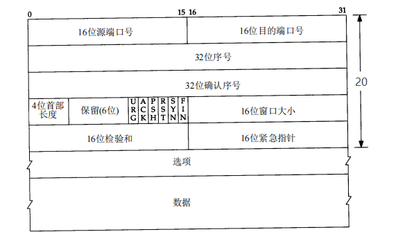

1. **源端口和目的端口** 各占2个字节。TCP的分用功能是通过端口实现的。

2. **序号** 占4个字节。 取值范围[0, 2^32-1]，序号增到最大时又会从0开始。TCP是面向字节流的，
在一个TCP连接中传送的字节流中的**每一个字节都按序编号**。整个要传送的字节流的起始序号必须在建立
连接时设置。首部中的序号字段值则指的是**本段报文**所发送的数据的第一个字节的序号。例如，一报文段
的序号字段值为301，而携带的数据共有100个字节，这就表明：本报文段的数据第一个字节的序号是301，
最后一个字节的序号是400，下一个报文段的数据序号应当从401开始，既下一个报文段的序号字段值应为401。
这个字段的名称也叫做**“报文段序号”**。

3. **确认号** 占4个字节。是**期望收到对方下一个报文段的第一个数据字节的序号**。例如：B正确收到
了A发送的一段报文，其序号字段值是501，而数据长度是200字节（序号501-700），这表明B正确收到了A发送
的到序号700为止的数据。因此，B期望收到A的下一个数据序号是701，于是B在发送给A的确认报文段中把确认号
设置为701。注意：此时确认号是701，不是501也不是700。`若确认号=N，则表明：到序号N-1为止的所有数据
都已正确收到。`由于序号字段有32位，可对4GB的数据进行编号，在一般情况下可保证当序号重复使用时，旧序号
的数据早已通过网络到达终点了。

4. **数据偏移** 占4个字节。它指出TCP报文段的数据起始处距离TCP报文段的起始处有多远，实际就是指出TCP
报文段首部的长度。由于首部中有不确定长度的选项字段，因此此字段是必要的。注意：数据偏移字段的单位是32位
字，由于此字段只有4位，最大值为15，所以数据偏移能表示的最大长度为60个字节，这就是TCP首部的最大长度（既
选项长度不能超过40字节）。

5. **保留** 占6位。保留为今后使用，但目前应置位0.

6. **6个控制位**   
    - **紧急URG（URGent）** 当URG=1时，表示此报文段为紧急数据，高优先级传送，不要按照原来的排队顺序
    传送。例如：已经发送了很长的程序在远端主机上运行，但是现在要发送（Ctrl+C）中断运行，如果不使用紧急
    数据，那么这两个字符将存储在接收TCP的缓存尾部。只有在所有的数据处理完毕后这两个字符才被交付到接收方
    的应用程序。
    
    - **确认ACK** 仅当ACK=1时，**确认号**字段才有效。TCP规定，在连接建立后所有传送的报文都必须把ACK置1。
    
    - **推送PSH（PuSH）** 当两个应用程序进行交互式通信时，有时在一端的应用程序希望在键入一个命令后立即就
    能够收到对方的响应。在这种情况下，TCP就可以使用推送（push）操作。这时，发送方TCP把PSH置1，并立即创建
    一个报文段发送过去。接收方TCP收到PSH=1的报文段，就尽快地（即“推送”向前）交付接收应用程序，而不再等到
    整个缓存都填满后再向上交付。`虽然应用程序可以选择推送操作，但推送操作很少使用。`
    
    - **复位RST（ReSeT）** 当RST=1时，表明TCP连接中出现严重差错（如由于主机崩溃或其它原因），必须释放
    连接，然后再重新建立运输连接。RST置1还用来拒绝一个非法的报文段或拒绝打开一个连接。RST也成为重建位或
    重置位。
    
    - **同步SYN（SYNchronization）** 在建立连接时用来同步序号。当SYN=1而ACK=0时，表明这是一个连接
    请求报文段。对方若同意建立连接，则应在相应的报文段中使用SYN=1和ACK=1。因此，SYN置为1就表示这是一个
    连接请求或连接接收报文。
    
    - **终止FIN（FINis）** 用来释放一个连接。当FIN=1时，表示次报文段的发送方的数据已发送完毕，并要求
    释放连接。
    
7. **窗口** 占2个字节。取值范围[0, 2^16-1]，窗口指的是发送本报文段的一方的**接收窗口**，用来**告诉对方：**
从本报文段首部中的**确认号**算起，接收方目前允许对方发送的数据量（以字节为单位）。之所有要有这个限制，是因为
接收方的数据缓存空间是有限的。例如，发送了一个报文段，其确认号是701，窗口字段是1000。这就是高数对方：“从701
号算起，我（既发送此报文段的一方）的接收缓存空间还可以接受1000个字节数据（字节序号是701~1700），你在给我发
送数据时必须考虑到这一点”。`窗口值是经常在动态变化的`

8. **检验和** 占2个字节。 检验和字段检验的范围包括首部和数据这两部分。和UDP一样，在计算检验和时，要在TCP
报文段的前面加上12字节的伪首部。伪首部的格式和UDP的一样，但应把伪首部第4个字段（协议）改为6（TCP的协议号是6），
第5字段的UDP长度改为TCP长度。

9. **紧急指针** 占2个字节。紧急指针仅在URG=1时才有意义，它指出本报文段中的紧急数据的字节数（紧急数据结束后
就是普通数据）。因此，紧急指针指出了紧急数据的末尾在报文段中的位置。当所有紧急数据都处理完时，TCP就告诉应用
程序恢复到正常操作。**即使窗口为0时也可以发送紧急数据**。

10. **选项** 长度可变，最大40个字节。

## 三：可靠传输
TCP报文是交给IP层进行传送的，但是IP层只能尽最大努力的服务，也就是说，TCP下面的网络层所提供的服务是不可靠的
传输，因此TCP协议必须采用适当的措施才能使得两个传输层之间的通信变得可靠。

###ARQ协议
自动重传请求（Automatic Repeat-reQuest，ARQ），通过**确认**和**重传**机制，可以在不可靠的
传输网络上实现可靠地通信。重传的请求是自动进行的，接收方不需要请求发送方重传某个出错的分组（因为
只要请求方没有在规定时间内收到确认，就会自动重传）。它包括停止等待ARQ协议和连续ARQ协议。

###停止等待ARQ协议
1. 每发完一个分组就停止发送，等待对方的确认。在收到确认后再发送下一个分组。

2. 每发送完一个分组时设置一个**超时计时器**。如果超时之前收到了确认，就撤销已设置的超时计时器。

3. **超时重传**，如果超过了一定时间仍然没有收到确认，则认为刚才发送的分组丢失了，就会重新传送前面发送过的分组。

4. 发送完一个分组后，**必须暂时保留已发送的分组的副本**，在发生超时重传时使用，收到响应后删除分组副本。

5. **确认丢失**， A给B发送报文（REQ），B成功收到并给A发送确认（ACK），但是A没有收到B发送的确认（ACK），
A在超时后重新发送报文（REQ），B第二次收到报文（REQ）后会直接丢弃，然后B再次发送确认（ACK）。

6. **确认迟到**， A给B发送报文（REQ），B成功收到并给A发送确认（ACK1），但是A在超时时间内没有收到确认（ACK1），
A在超时后重新发送报文（REQ），B第二次收到报文（REQ）后会直接丢弃，然后再次发送确认（ACK2），A收到确认（ACK2）后
进行了相应的处理后，又接收到了迟到的确认（ACK1），这时A对于确认（ACK1）什么都不处理。

```
停止等待协议的优点就是简单，缺点是信道利用率低下，每次发完分组后，就要等着确认，中间的时间都浪费了。
```

###流水线传输
流水线传输就是发送方可连续发送多个分组，不必每发完一个分组就停止等待对方的确认。这样可使信道上一直有
数据在不间断的传送。理论上的流水线传输会达到下图所示的样子：  
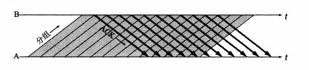
发送方A持续不断地逐条将分组发送给B，不停止等待确认，过一段间隔时间后，每条确认就会连续不断地接受到。
这是理想的状态，既没有丢包，都按序到达的完美状态。  

###连续ARQ协议和滑动窗口协议
实际环境中的流水线传输，需要考虑到丢包、乱序、缓存空间可用大小等问题，就需要使用到连续ARP协议和滑动
窗口协议来实现了。  
下面根据一组实际例子来了解下，A为发送方，B为接收方。

**某一刻A的窗口如下图所示：**    
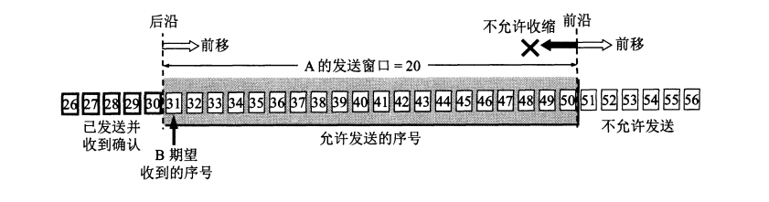

1. 窗口为31-50的一段，那么窗口的大小就是20，A可以连续发送从31到50的20个分组而不会导致B的接收缓冲区不够用。
显然，窗口越大，发送方就可以在收到接收方的确认之前连续发送更多的数据，获得更高的传输效率。

2. 窗口大小是A根据B发送的确认报文段中的**窗口字段**来确定的。

3. 窗口后沿31是根据B发送确认报文段中的**确认号字段**来确定的，确认号是31表示B期望收到的下一个序号是31，
也说明到30位置的数据都已经收到了。

4. 此图中可以分为三部分：
    - 26-30：窗口之后表示已经发送并收到确认的（实际上收到确认后会从发送缓冲区删除掉的，
    此图只是为了表示出来已发送并收到确认的数据，所以发送窗口的后沿是和发送缓冲区的后沿重叠的）。
    - 31-50：窗口内部表示可以发送的（里面可以有已发送的，也可以有未发送的）
    - 51-56：窗口之前表示发送缓冲区中不能发送的数据。

5. 发送窗口后沿的位置有两种变化：
    - 不动：因为没有收到新的确认
    - 前移：因为收到了新的确认
    - 不可能向后移动，因为不可能撤销掉已收到的确认。

6. 发送窗口前沿的位置理论上有三种变化：
    - 不动：没有收到新的确认，并且对方通知的窗口大小也不变；收到了新的确认，但是对方通知的窗口缩小了。
    - 前移：收到了新的确认并且窗口大小不变或者变大。
    - 后移：窗口缩小，但是TCP标准**强烈不赞成这样做**，因为发送方可能在收到这个通知以前已经发送了窗口
    中的许多数据，现在又要收缩窗口，不让发送这些数据，可能会产生一些错误。
    

**A连续发送了窗口中的11个分组后的效果：**  
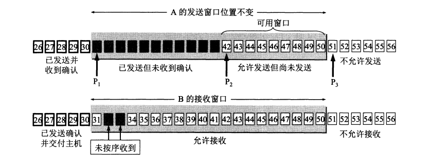
1. A已经将窗口中的31~41发送完毕，42~50还未发送。

2. B收到了32和33，但是31未收到，31也许丢失了，也是还滞留在网络中。B只能对按序收到的数据中的最高序号
给出确认，一次B发送的确认报文段中的确认号仍然是31（既往收到的序号）。

3. 接收方一般采用**累积确认**的方式。不必对收到的每个分组逐个发送确认，可以在收到几个分组后，**对按序
到达的最后一个分组发送确认**， 表明到这个分组位置的所有分组都已正确收到了。累积确认的优缺点如下：
    - 优点是容易实现，即使确认丢失也不必重传。比如说第一个确认号是10的丢失了，但是收到了第二个确认号是
    12的确认，也就代表12之前的都收到了，10的确认丢失了也不影响。
    - 缺点是不能像发送方反映出接收方已经收到的所有分组信息。比如说发送方发送了1~5个分组，而中间的3号
    分组丢失了。这时接收方只能对前面两个（1、2号）分组发出确认。发送方只好把后三个（3、4、5号）分组都
    重传一次。这叫做Go-back-N（回退N），表示需要再退回来重传已发送过得N个分组。可见当通信线路质量不好
    时，连续ARQ协议会来来负面的影响。


**B收到了31号分组，并发送了确认**  
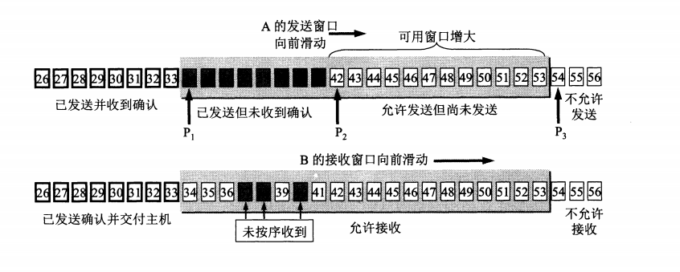
1. B收到了31号分组，并把序号为31~33的数据交付给主机，然后B删除这些数据。接收窗口向前移动3个序号，同时
给A发送确认，其中窗口值仍为20，但确认号是34。表明B已经收到了到序号33为止的数据。

2. B同时收到了37、38和40号的数据，但是这些都没有按序到达，只能先暂存在接收窗口中。

3. A收到B的确认号34，窗口值20，把发送窗口向前移动3个序号，但指针P2不动，可以看出A的可用窗口增大了，可以
发送序号42~53的分组。


**A继续发送完序号42~53的数据**  
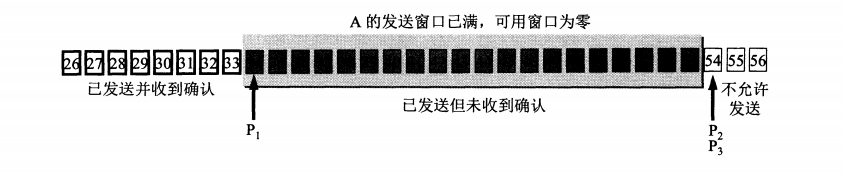
A发送窗口中的数据都已发送完毕，但是还未收到新的确认，因此必须停止发送。如果一段时间内还未收到确认，A将重传
这部分数据。如果A收到了确认，就可以将发送窗口继续向前滑动，并发送新的数据。

##四：TCP连接的管理
TCP的连接分为三个阶段：**连接建立、数据传送和连接释放**。

###连接建立
TCP连接建立过程中要解决一下三个问题：
1. 要使每一方都能知道对方的存在。
2. 要允许双方协商一些参数（如最大窗口值、是否使用窗口扩大选项和时间戳选项等）。
3. 能够对运输实体资源（如缓存大小、连接表中的项目等）进行分配。

####正常连接建立
TCP连接的建立采用客户端服务器模式。主动发起连接建立的一方叫做**客户（client）**，而被动等待连接建立的一方
叫做**服务器（server）。连接使用三个报文完成，这个过程称为three-way handshake（三次握手）。如下图所示：  
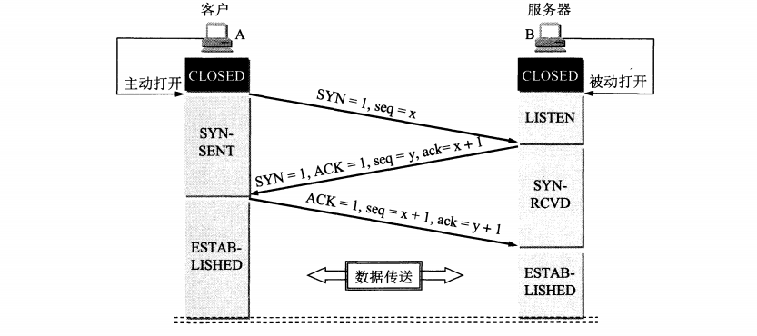

1. **第一个报文**： A向B发送连接请求报文，报文首部中同步位SYN=1，同时选择一个初始序号seq=x。TCP规定，
SYN报文（既SYN=1的报文）不能携带数据，但要**消耗掉一个序号**。这时A进入**SYN-SENT（同步已发送）** 状态。

2. **第二个报文**： B收到连接请求报文后，则向A发送确认。在确认报文段中应把首部的SYN位和ACK位都置为1，
确认号ack=x+1，同时也为自己选择一个初始序号seq=y。这个报文也不能携带数据，同样要消耗掉一个序号，因为
SYN=1。这时B进入**SYN-RCVD（同步接收）** 状态。

3. **第三个报文**： A收到B的确认后，还要再向B发送确认。确认报文ACK位置1，确认号ack=y+1，自己的确认号
seq=x+1。TCP规定，ACK报文可以携带数据。但**如果不携带数据则不消耗序号**，在这种情况下，下一个数据报文
的序号仍是seq=x+1。这是，TCP连接已经建立，A进入**ESTABLISHED（已建立连接）**装填。  
B收到A的确认后，也进入**ESTABLISHED**状态。

```
上述的第二个报文其实也可以拆成两个报文。可以先发送一个确认报文（ACK=1，ack=x+1），然后再发送一个同步
报文段（SYN=1，seq=y），效果是一样的。
```

**为什么A最后还要再发送一次确认呢？**  
1. 我们先假设前两个报文交互后双方就进入ESTABLISHED状态。假设A发送了建链请求报文1a，但是因为滞留在网络中，导致
A重传了建链报文1b，这时B收到了1b并成功响应，双方进入ESTABLISHED状态，然后A和B交互完数据关闭了连接。这时B又收
到了网络中滞留的建链请求1a，B以为是A正常的建链请求，正常响应，并且B进入了ESTABLISHED状态，但是A收到本次响应后
是不会处理的，因为自己都没有请求建链。后续B的该链路将一直在等待A发送过来数据，B的许多资源就这样浪费掉了。

2. TCP的交互是采用的停止等待协议，既发送过后要等到对方确认。三次握手中的第二次报文可以看成两个报文的组合，既确认
A发送的第一个请求报文的确认报文（ACK），和B自己发送了一个请求报文（SYN），所以B要等到收到了A对自己的请求报文的
确认报文（ACK）之后才算B的请求完成了。

**如果B收不到第三个ACK报文会是什么情况呢？**
1. 如果B收不到第三个ACK报文，会重传第二个SYN+ACK报文，重传次数在`/proc/sys/net/ipv4/tcp_synack_retries`
中有指定，如果重传次数达到上线后，B仍未收到ACK报文，B会自动关闭连接。但是此时A已经认为链路建好了，如果A发送了数据
给B，则B会响应复位RST包。

2. SYN攻击就是利用这个点进行的，发送大量的建链请求到目标机器，但是就不正常响应最后一个ACK，导致B的资源都耗在
SYN-RCVD状态，导致资源耗尽。

####同时发起连接建立
除了客户端一方先发起建立连接请求的方式外，还可能会发生双方同时发起建立连接请求的情况。如下图所示：  
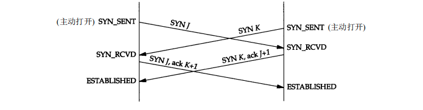
1. 双方同时发送SYN报文，并且进入**SYN-SENT**状态
2. 双方收到对端的SYN报文后，都再发送SYN+ACK报文进行确认，进入**SYN-RCVD**状态
3. 收到SYN+ACK报文后进入**ESTABLISHED**状态


###连接释放

####正常连接释放
通信双方都可以主动释放连接。通过四个报文的交互来进行。下图以A主动释放为例：  
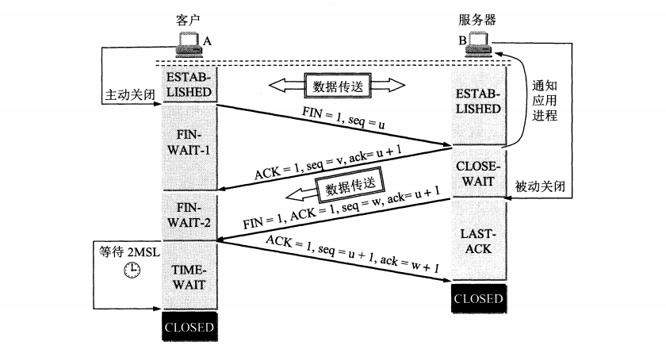

1. **第一个报文**： A向B发送连接释放报文（FIN），报文首部终止控制位FIN=1，其序号seq=u，u等于前面已传送过的数据的
最后一个字节的序号加1。这时A进入**FIN-WAIT-1(终止等待1)** 状态，等待B的确认。TCP规定，FIN报文即使不携带
数据，也要消耗掉一个序号。

2. **第二个报文**： 
    - B收到A发送过来的连接释放报文后既发出确认（ACK），报文首部ACK控制位置1，确认号是ack=u+1，这个报文中自己的序号是v，
    v等于B前面已传送过得数据的最后一个字节的序号加1。然后B就进入了**CLOSE-WAIT（关闭等待）** 状态。
    - A收到来自B的确认后，就进入**FIN-WAIT-2（终止等待2）** 状态， 等待B发出的连接释放报文。
    - 这时的TCP连接处于**半关闭（half-close）** 状态，既A已经没有数据要发送了，但B若发送数据，A仍要接收。也就是说，
    从B到A这个方向的连接并未关闭，这个状态可能会持续一段时间。
    
3. **第三个报文**： 若B已经无数据需要发送，就会发出连接释放报文，其中FIN=1，序号为w（w不一定等于v，因为在半关闭状态下
B也可能会发送一些数据），确认号必须重复上次已经发过的ack=u+1。这时B进入**LAST-ACK（最后确认）** 状态，等待A的确认。

4. **第四个报文**： A收到B的连接释放报文后，须对此发出确认。确认报文中ACK置1，确认号ack=w+1，而自己的序号是seq=u+1，
因为根据TCP规定，前面发送过的FIN报文要消耗掉一个序号。然后A进入**TIME-WAIT(时间等待)** 状态。B收到此确认后，就正常
释放掉了。A必须经过**时间等待计时器（TIME-WAIT timer）** 设置的事件2MSL后，才进入到CLOSED状态。

```
时间MSL叫做**最长报文寿命（Maxinum Segment Lifetime），建议设为2分钟。对于现在的网络环境，MSL=2分钟太长了一些。
因此可以根据自己实际的情况来调整MSL值。
```

**为什么A在TIME-WAIT状态必须等待2MSL的时间呢？**
1. 为了保证A发送的最后一个ACK报文（第四个报文）能够到达B。因为这个ACK报文有可能丢失，B会超时重传FIN+ACK报文（第三个报文），
而A就可以在2MSL时间内收到这个重传的FIN+ACK报文，接着A重传一次确认（第四个报文），重新启动2MSL计时器。否则最后一个ACK报文
如果到达不了B，B将无法正常释放连接。

2. 如果A和B正常通信过程中的一个报文超时（未丢失，只是滞留在了网络中），后续A又重传了报文正常处理了。A如果不等待2MSL时间的话，
很可能该端口很快又和服务端正常建链了，这事上一次链路中的超时报文被服务端接受到了，就有可能引起错误。所以等待2MSL时间也是为了
让网络中滞留的报文都死掉再重复使用本地端口来建立新的连接。

####同时发起连接释放
同时发起连接释放的过程如下图所示：  

1. 发送FIN报文，进入**FIN-WAIT-1**状态
2. 收到对端的FIN报文，发出响应ACK报文，进入**CLOSING**状态
3. 收到ACK报文，进入**TIME-WAIT**状态

##五：TCP的拥塞控制
TCP进行拥塞控制的算法有四种：**慢开始（slow-start）、拥塞避免（congestion avoidance）、快重传（fast retransmit）
和快恢复（fast recovery）**，拥塞控制也叫**基于窗口的拥塞控制**。发送方会位置一个叫做**拥塞窗口cwnd（congestion window）**
的状态变量。拥塞窗口的大小取决于网络的拥塞程度，并且动态的在变化。**发送方让自己的发送窗口等于拥塞窗口**。  
发送方控制拥塞窗口的原则是：只要网络没有出现拥塞，拥塞窗口就再增大一些，以便把更多的分组发送出去，提高网络利用率。但只要
网络出现拥塞或有可能出现拥塞，就把拥塞窗口减小，已缓解网络出现的拥塞。**判断拥塞的依据就是出现了超时**。
```
为了便于理解，下面讨论的算法有以下假设：
1. 数据是单方向传送的，对方只传送确认报文。
2. 接收方总是有足够大的缓存空间，因为发送窗口的大小有网络的拥塞程度决定。
3. 采用报文段的个数作为窗口大小的单位，方便用较小的数字来阐明拥塞控制的原理。
```

###拥塞控制-慢开始算法
慢开始的思路是：当主机开始发送数据时，由于并不清楚网络的负荷情况，所以如果立即把大量的数据注入到网络中，那么就有可能
引起网络拥塞。最好的结果是先探测一下，既**有小到大逐渐增大发送窗口（拥塞窗口数值cwnd）**，TCP规定，初始拥塞窗口cwnd设置
为不超过2到4个SMSS的数值。**SMSS（Sender Maximum Segment Size）** 为发送方的最大报文段的数值。
下图为cwnd值的变化情况：  
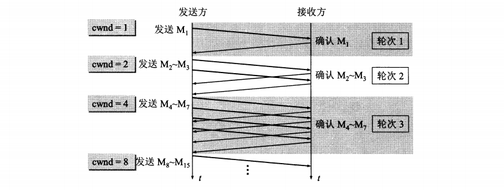  
1. cwnd=1时， 可以发送一个报文段M1，收到确认后，cwnd变为1+1=2
2. cwnd=2时， 可以发送两个报文段M2、M3，收到确认后，cwnd变为2+2=4
3. cwnd=4时， 可以发送四个报文段M4~M7，收到确认后，cwnd变为4+4=8

可以看出每收到一个确认，cwnd的值就加1。使用慢开始算法时，**每经过一个轮次（transmission round），拥塞窗口cwnd就加倍。**  
```慢开始的增长速度其实一点都不慢，成倍的增长，只不过是开始的值比较小而已```

###拥塞控制-拥塞避免算法
为了防止拥塞窗口cwnd 增长过大引起网络拥塞，还需要设置一个**慢开始门限ssthresh**状态变量。慢开始门限ssthresh的用法如下：
1. 当cwnd<ssthresh时，使用慢开始算法。
2. 当cwnd>ssthresh时，停止使用慢开始算法而改用拥塞避免算法。
3. 当cwnd=ssthresh时，即可使用慢开始算法，也可使用拥塞避免算法。

**拥塞避免算法**的思路是让拥塞窗口cwnd缓慢地增大，既每一个轮次下来cwnd的值只增加固定值（实际是按照字节数增长的），
而不再像慢开始算法那样倍数增长，增长速度比慢开始算法慢得多。当出现网络超时时，ssthresh=cwnd/12，cwnd重置为1。

### 拥塞控制-快重传算法
**快重传算法**的思路是**让发送方尽快知道发生了个别报文的丢失**，然后立即重传，避免出现超时。所以首先要求接收方不要等待自己发送数据是才进行
捎带确认，而是要**立即发送确认**，即使收到了**失序的报文段**也要立即发出对已收到的报文段的重复确认。   
如下图所示：  
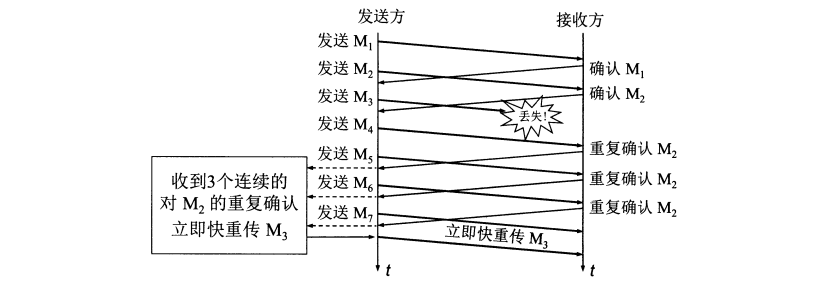
1. 接收方收到M1和M2后分别及时发出来确认。
2. M3报文丢失，接收方未能收到。
3. 接收方又收到了M4、M5和M6，然后这三个报文段的确认发送的是M3。
4. 接收方就会连续收到三个重复的对M3的确认，应当**立即进行重传**，这样就不会出现超时。

### 拥塞控制-快恢复算法
**快恢复算法**的思路是**快重传**算法检测到了个别报文的丢失（不是超时），然后将ssthresh=cwnd/2,cwnd=cwnd/2（这样设值会触发拥塞避免算法）。
主要是区别于发现超时后使用慢开始。个别报文段在网络中丢失，并不代表着网络发生拥塞。如果这时直接启用慢开始，把拥塞窗口设置为1，会降低传输效率。


### 拥塞控制示意图
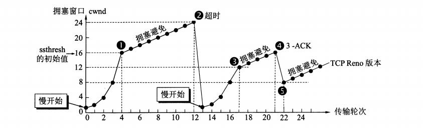

1. 从第0个传输轮次开始执行**慢开始算法**，拥塞窗口cwnd后续迅速增长。
2. 到第4个传输轮次时，拥塞窗口cwnd达到了慢开始门限ssthresh的值（编号1的位置），后续开始执行**拥塞避免**算法。
3. 到第12个传输轮次时，检测到了超时（编号2的位置），于是调整慢开始门限值 ssthresh=cwnd/2=12，拥塞窗口值 cwnd=1，并再次开始使用**慢开始**算法。
4. 到第17个传输轮次时，拥塞窗口cwnd再次达到了慢开始门限ssthresh的值（编号3的位置），后续开始执行**拥塞避免**算法。
5. 到第21个传输轮次时，发送方连续收到了三个队同一个报文段的重复确认（编号4的位置，图中标为3-ACK），
于是调整慢开始门限值 ssthresh=cwnd/2=8，拥塞窗口值 cwnd=cwnd/2=8，后续开始拥塞避免算法（编号5的位置）。