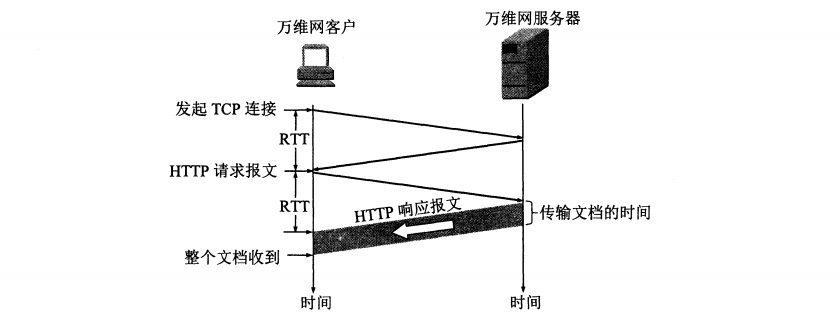
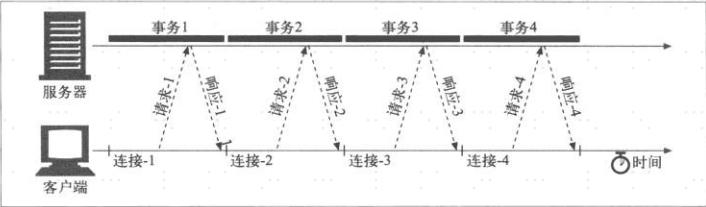
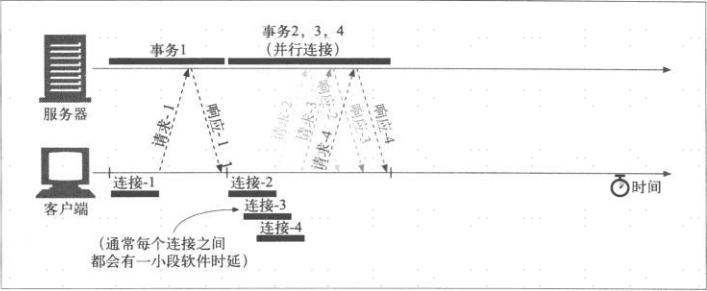
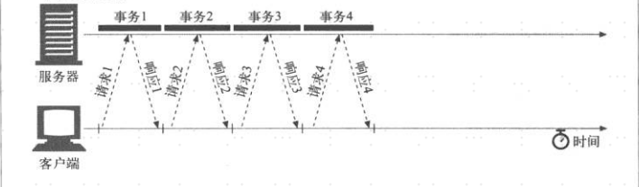
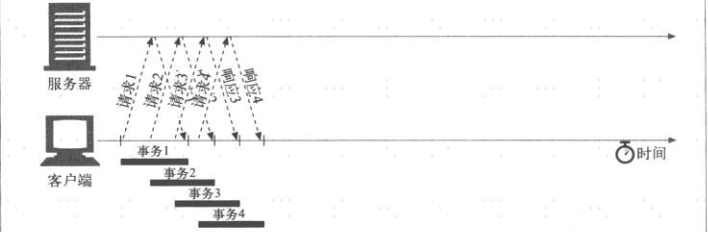
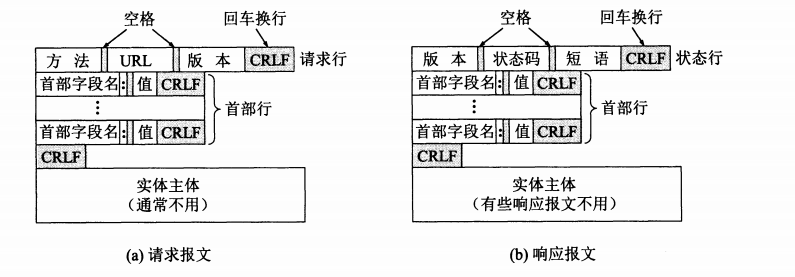

#HTTP协议

##一：概述
HTTP协议（Hypertext Transfer Protocol，超文本传输协议）是一个简单的请求-响应协议，属于应用层协议。
它通常使用TCP连接传送，保证了数据的可靠传输，但是HTTP协议**本身是无连接的**，虽然HTTP使用了TCP连接，
但是通信双方在交换HTTP报文之前不需要先建立HTTP连接。  
HTTP协议是**无状态的（stateless）**，也就是说，同一个客户第二次访问同一个服务器上的资源时，服务器的
响应与第一次被访问时的相同，因为服务器并不知道曾经访问过得这个客户。HTTP协议的无状态性简化了服务器的设
计，使服务器更容易支持大量并发的HTTP请求。

##二：HTTP的连接和请求过程
一次HTTP请求发生时，首先要和服务器建立TCP连接。TCP的建链过程需要三次握手。当TCP建链的三次握手报文的前两个
报文完成后，客户端就把HTTP的请求报文，作为TCP建链过程三次握手中的第三个报文发送给服务器（因为第三个握手
报文是一个ACK，TCP规定ACK是可以携带数据的）。服务器收到HTTP请求报文后，处理完成再把响应报文返回给客户端。
如下图所示：    

从上面可以看出，一个HTTP请求所需要的事件是2倍往返时间RTT（一个RTT用于TCP建链，连一个RTT用于请求和接收响应）。

###链接处理方式
链接类型分为以下两种：
- 非持久连接：每次请求之后都会关闭连接。缺点是每次都需要建链和断链，还需要经历TCP的慢启动过程，时延高。
- 持久连接：请求处理完成之后将TCP链接保持在打开状态，以便后续的请求重用。省了建链、断链、慢启动的过程，时延低。

处理方式分为以下两种：
- 串行处理：多个请求串行处理，收到第一个请求的响应后再发送第二个请求，依次发送请求处理相应。缺点是时延较高、传输效率低、宽带利用率低。
- 并行处理：发送完第一个请求之后，在未收到响应前就可以一次发送第二个、第三个请求。时延低、传输效率高、宽带利用率高（带宽足够的情况下）。

下面通过链接类型+处理方式，分别描述4种不同类型的处理情况。以请求一个页面，页面中包含三个图片，一共四个请求为例说明：

####1.非持久链接+串行处理
每个请求都需要串行的建立一个新的链接，那么建链时延和慢启动时延就会叠加起来，如下图所示：  
  
缺点：时延过高，带宽利用率低

####2.非持久连接+并行处理
同样四个请求，并行链接就可以先请求页面，然后并行的请求三个图片，这样建链时延和慢启动时延就是重叠的，
减少了总时延，也可以充分利用带宽资源。 如下图所示：  
  
缺点：
- 每个请求都会打开/关闭一条新的链接，会消耗时间和带宽
- 由于TCP慢启动，每条新链接的性能都会有所降低
- 可同时打开的并行连接数量是有限的

####3.持久连接+串行处理
持久连接串行处理相对于非持久连接串行处理就节约了每次建链的时延和慢开始的时延。如下图所示：  
  

####4.持久链接+并行处理（管道化持久连接）
即节约了建联和慢启动的时延，又并行增加了传输效率。如下图所示：

正常情况下浏览器是会创建多条持久链接，然后每个持久连接上都可以并行处理，这样效率是最高的。

##三：HTTP报文结构
HTTP有两类报文：
1. **请求报文**：从客户端向服务器发送的报文。
2. **响应报文**：从服务器到客户端的应答。

HTTP的报文格式如下图所示：  

1. **开始行** ：用于区分是请求报文还是响应报文。在请求报文中叫做**请求行（Request-Line）**，
在响应报文中叫做**状态行（Status-Line）**。开始行的三个字段之间都已空格分开，最后的**CR和LF**
分别代表**回车和换行**。
    - **请求行-方法**： 就是所请求的对象进行的**操作**，包括：**PUT、GET、POST、DELETE**等。
    - **请求行-URL**： 统一资源定位符。
    - **版本**： HTTP协议版本，HTTP/1.0或HTTP/1.1。
    - **状态行-状态码**： 都是三维数字，分为5大类，每一类都以相同的数字开头。
    - **状态行-短语**： 用来解释状态码的简单短语。
2. **首部行** ：就是常说的报文头，用来说明客户端、服务器或报文主题的一些信息。首部可以有0到多行，
每一行都是由首部字段名和它的值组成（name:value），每一行也都已**回车和换行**结束。首部结束时，
还有一空行将首部和后面的实体主题分开。

3. **实体主体（entiry body）** ：就是常说的报文体，只有在POST操作种才会有。

### 常用的操作及意义
|操作（方法）|意义|
|----------|---|
|OPTION|请求一些选项的信息|
|GET|请求读取由URL所标志的信息|
|HEAD|请求读取由URL所标志的信息的首部|
|POST|给服务器添加信息|
|PUT|在指明的URL下存储一个文档|
|DELETE|删除指明的URL所标志的资源|
|TRACE|用来进行环回测试的请求报文|
|CONNECT|用于代理服务器|

###状态码的五大类别
1. 1xx：表示通知信息，如请求收到了或正在进行处理。
2. 2xx：表示成功，如接受或知道了。
3. 3xx：表示重定向，如要完成请求还必须采取进一步的行动。
4. 4xx：表示客户的差错，如请求中有错误语法或不能完成。
5. 5xx：表示服务器的差错，如服务器无效无法完成请求。

