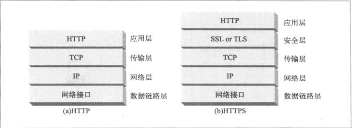

#HTTPS协议

##一：概述
HTTPS是安全版本的HTTP。HTTPS将加密的HTTP报文发送给TCP再进行传输，它在将HTTP报文发送给TCP之前，
先发送给了一个安全层（SSL/TSL）进行加密。结构如下图所示：  
  
SSL:Secure Socket Layer  
TSL:Transport Layer Security

##二：SSL握手
HTTPS加密都是根据握手协议产生的一个会话秘钥（对称）来加密报文的。  
握手主要完成以下工作：
- 协商加密算法、鉴别方法、压缩方法
- 两端相互鉴别对方身份
- 生成临时的会话秘钥用以加密报文

握手协议分为以下步骤：
1. 客户端将它所支持的算法列表以及用于生成秘钥的随机数发送给服务器。
2. 服务器将选中的加密算法、一个用于生成秘钥的随机数和服务器公钥证书发送给客户端。
3. 客户端验证服务器公钥证书通过后，产生一个pre_master_secret随机密码串，使用服务器公钥进行加密，
将加密后的信息发送给服务器。服务器可以根据自己的私钥解密出pre_master_secret明文。
4. 客户端和服务端根据秘钥交换算法（KDF）使用交换的两个随机数以及pre_master_secret独立计算出会话秘钥。
5. 客户端将所有握手协议的MAC值发送给服务器。
6. 服务器将所有握手协议的MAC值发送给客户端。

第5、6步是为了防止握手本身遭受篡改。客户端提供的多种算法中，有高强度的也有低强度的。
攻击者可以删除客户端在第1步所提供的所有高强度算法，迫使服务器选择一种低强度算法。
第5、6步的MAC交换就能阻止这种攻击，因为客户端的MAC是根据原始消息计算出来的，而服务端
的MAC是根据篡改后的消息计算出来的，这样经过对比就会发现双方MAC值不匹配。  