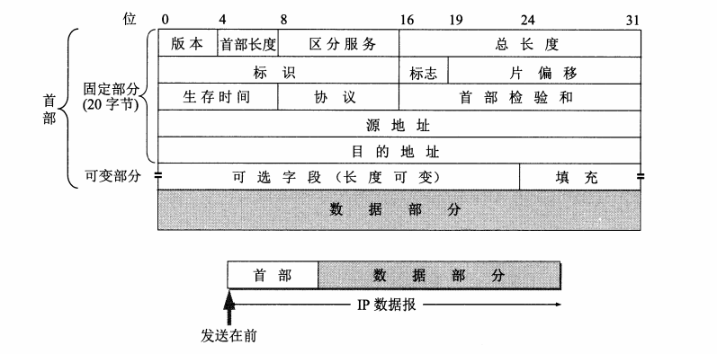

#IP协议
  IP是TCP/IP协议族中最为核心的协议。所有的TCP、UDP、ICMP及IGMP数据都已IP数据报格式传输。  
    
  不可靠（unreliable）的意思是它不能保证IP数据报能成功地到达目的地。IP仅提供最好的传输服务。
如果发生某种错误时，如某个路由器暂时用完了缓冲区，IP有一个简单的错误处理算法：丢弃该数据报，
然后发送ICMP消息报给信源端。任何要求地可靠性必须有上层来提供（如TCP）。  
  
  无连接（connectionless）这个术语的意思是IP并不维护关于后续数据报的状态信息。每个数据报的
处理都是相互独立的。这也说明，IP数据报可以不按发送顺序接收。如果一信源向相同的信宿发送两个连续地
数据报（先是A，然后是B），每个数据报都是独立地进行路由选择，可能选择不同的路线，因此B可能在A到达
之前先到达。

##格式

个字段意思如下：  
1. **版本**： 占4位，指IP协议的版本。通信双方使用的IP协议版本必须一致。目前广泛使用的IP协议号为4（既IPV4）。

2. **首部长度**： 占4位，可表示最大十进制数值是15。注意，首部长度字段所表示的单位是32位字（既4字节）。
因为IP首部的固定部分长度是20字节，所以首部长度最小值是5（既0101）。而当首部长度为最大值1111时（既十进制数是15），
就表明首部长度达到最大值15个32位字长，既60字节。当IP首部长度不是4字节的整数倍时，必须利用最后的填充字段加以填充。
因此IP数据报的数据部分永远在4字节的整数倍开始，这样在实现IP协议时比较方便。首部长度限制为60字节的缺点是有时可能不够用。
但这样做是希望用户尽量减少开销。最常用的首部长度是20字节，这时不适用任何选项。

3. **分区服务（服务类型TOS）**： 占8位，包括一个3位的优先权子字段（现在已被忽略），4为的TOS子字段和1位未使用位但必须置0。
4位的TOS分别代表：最小延时、最大吞吐量、最高可靠性和最小费用。4位中只能置其中一位。如果所有4位均为0，那么意味着一般服务。

4. **总长度**： 总长度指首部和数据之和的长度，单位为字节。总长度字段位16位，因此数据报的最大长度为2^16 - 1=65535字节。